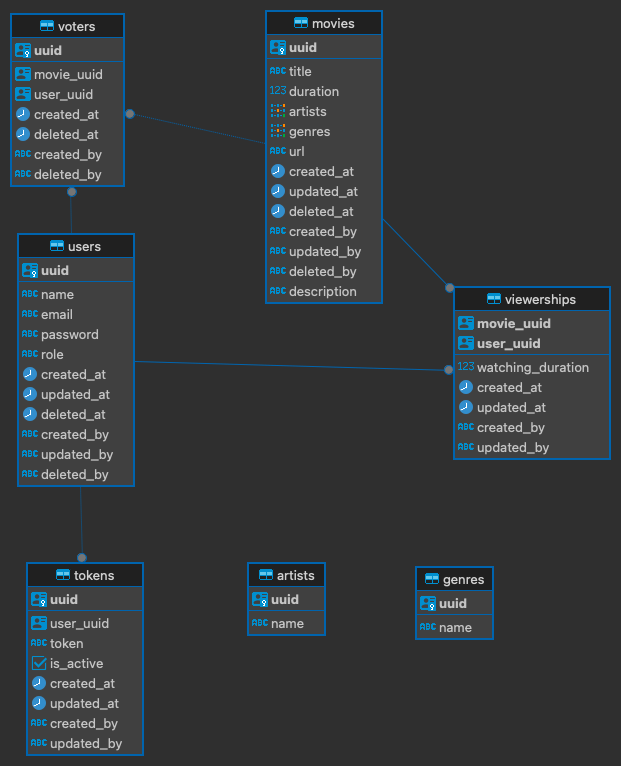

**WELCOME TO THE MOVIE FESTIVAL**

*TABLE OF CONTENTS*
1. [FEATURES](#features)
2. [ERD DIAGRAM](#erd-diagram)
3. [LOCAL SETUP](#local-setup)
4. [DEPLOYMENT DOCKER](#deployment-docker)
5. [GENERATE SWAGGER DOCS](#generate-swagger-docs)
6. [RUN UNIT TEST](#run-unit-test)


## Features
1. Signup users
2. Signup admin
3. Login
4. Logout
5. Create a movie by admin
6. Update a movie by admin
7. Upload a movie file by admin
8. Vote a movie by users
9. Un-vote a movie by users
10. Get list of voted movies
11. Search movies by filter title, description, artists, genres
12. Track movie viewership by users
13. Get the most viewed movie by admin
14. Get the most viewed movie genre by admin

## ERD Diagram


## Local Setup
1. Copy env.example to .env
```bash
cp env.example .env
```
2. Filled out the env based on your local setup preferences
3. Run the project on terminal
```bash
go run main.go
```

## Deployment Docker
1. Make sure you already install docker and makefile
- [Install Docker](https://docs.docker.com/engine/install/)
- [Install Makefile MacOS](https://stackoverflow.com/questions/10265742/how-to-install-make-and-gcc-on-a-mac)
- [Install Makefile Linux](https://askubuntu.com/questions/161104/how-do-i-install-make)
- [Install Makefile Windows](https://stackoverflow.com/questions/32127524/how-to-install-and-use-make-in-windows)

2. Run this command to create the project and database container on docker using docker-compose file
```bash
make docker-up
```
2. Run this command to delete the project and database container on docker using docker-compose file
```bash
make docker-down
```

## Generate Swagger Docs
1. Install swaggo module on your local computer
```bash
go install github.com/swaggo/swag/cmd/swag@latest
```
2. Generate swagger docs
```bash
swag init --parseDependency --parseInternal --parseDepth 1 --overridesFile .swaggo
```
3. Run the project and open the Open API Swagger. The url for Open API Swagger `{baseURL}/docs/swagger/index.html`

## Run Unit Test
1. Run unit test using make
```bash
make test
```
2. Or run unit test with this command
```bash
go test -v ./...
```